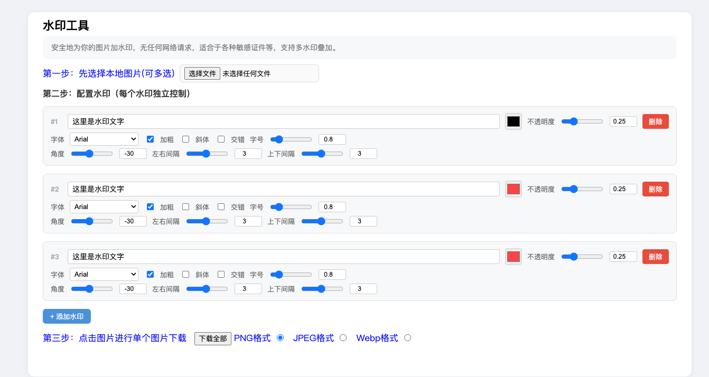

# offline-watermark 水印工具

## 简介
这是一个专门用于给身份证等敏感证件打水印的工具，完全基于浏览器本地 API，无任何网络请求。
支持多水印叠加，每个水印可完全独立设置文字、颜色、字体、字号、角度、间距等所有参数。

## 新增功能
- **多水印叠加**：支持添加多个水印，每个水印独立控制所有参数
- **每个水印独立控制**：文字、颜色、不透明度、字体、加粗、斜体、交错排列、字号、角度、水平间距、垂直间距
- **图片管理**：支持查看和删除已选中的图片

## 使用
直接下载 `watermark.html` 在本地浏览器打开。

## 致谢
本项目 fork 自 [sleepybear1113/offline-picture-watermark](https://github.com/sleepybear1113/offline-picture-watermark)，并在此基础上进行修改。
